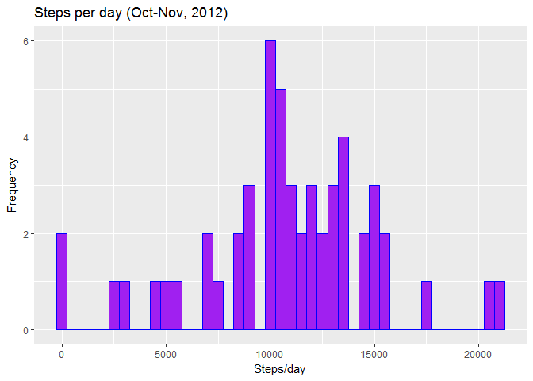
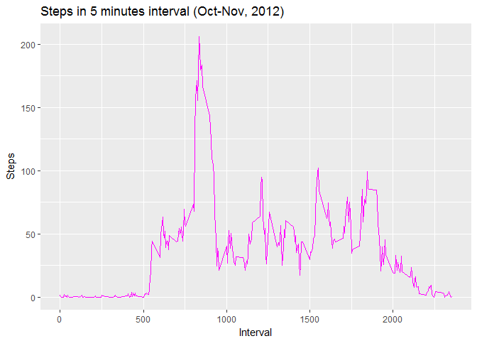
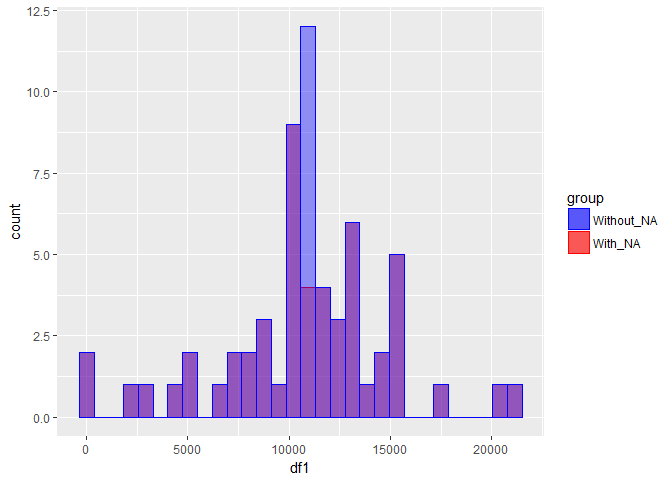

# Reproducible Research: Peer Assessment 1
#Introduction

It is now possible to collect a large amount of data about personal movement using activity monitoring devices such as a *Fitbit, Nike Fuelband, or Jawbone Up*. These type of devices are part of the “quantified self” movement – a group of enthusiasts who take measurements about themselves regularly to improve their health, to find patterns in their behavior, or because they are tech geeks. But these data remain under-utilized both because the raw data are hard to obtain and there is a lack of statistical methods and software for processing and interpreting the data.

This assignment makes use of data from a personal activity monitoring device. This device collects data at 5 minute intervals through out the day. The data consists of two months of data from an anonymous individual collected during the months of October and November, 2012 and include the number of steps taken in 5 minute intervals each day.

##The data can be found in this repository, as a .CSV file.

### Data structure:
- steps: Number of steps taking in a 5-minute interval (missing values are coded as NA)
- date: The date on which the measurement was taken in YYYY-MM-DD format
- interval: Identifier for the 5-minute interval in which measurement was taken


**First download the needed packages for this assignment**

```r
packages <- c("data.table", "dplyr", "reshape2", "ggplot2", "lubridate")
sapply(packages, require, character.only = TRUE, quietly = TRUE)
```

```
## 
## Attaching package: 'dplyr'
```

```
## The following objects are masked from 'package:data.table':
## 
##     between, first, last
```

```
## The following objects are masked from 'package:stats':
## 
##     filter, lag
```

```
## The following objects are masked from 'package:base':
## 
##     intersect, setdiff, setequal, union
```

```
## 
## Attaching package: 'reshape2'
```

```
## The following objects are masked from 'package:data.table':
## 
##     dcast, melt
```

```
## 
## Attaching package: 'lubridate'
```

```
## The following objects are masked from 'package:data.table':
## 
##     hour, isoweek, mday, minute, month, quarter, second, wday,
##     week, yday, year
```

```
## The following object is masked from 'package:base':
## 
##     date
```

```
## data.table      dplyr   reshape2    ggplot2  lubridate 
##       TRUE       TRUE       TRUE       TRUE       TRUE
```

## Loading and preprocessing the data

Second you need to read the CSV file and process the data (if necessary)

Here I changed the data format, othewise, its not possible to do the last assignment

```r
data <- read.csv(file = "activity.csv", header = TRUE, sep = ",", colClasses = c("numeric", "character", "integer"))
data$date <- ymd(data$date)
str(data)
```

```
## 'data.frame':	17568 obs. of  3 variables:
##  $ steps   : num  NA NA NA NA NA NA NA NA NA NA ...
##  $ date    : Date, format: "2012-10-01" "2012-10-01" ...
##  $ interval: int  0 5 10 15 20 25 30 35 40 45 ...
```


## What is mean total number of steps taken per day?

1 - Calculate the total number of steps a day.
2 - Make a histogram with the results.
3 - Report mean and median of the results.

*First calculate the sum of steps per day, use "group-by" date.*

*You can filtered "Nas" out of the analysis.*


```r
steps <- data %>%
  filter(!is.na(steps)) %>%
  group_by(date) %>%
  summarize(steps = sum(steps)) %>%
  print
```

```
## # A tibble: 53 x 2
##          date steps
##        <date> <dbl>
##  1 2012-10-02   126
##  2 2012-10-03 11352
##  3 2012-10-04 12116
##  4 2012-10-05 13294
##  5 2012-10-06 15420
##  6 2012-10-07 11015
##  7 2012-10-09 12811
##  8 2012-10-10  9900
##  9 2012-10-11 10304
## 10 2012-10-12 17382
## # ... with 43 more rows
```

Now you can make a histogram of the steps per day, using ggplot2.

*The important thing here is to have steps by frequency/counts, the other details are just aesthetical, you can use or not* 

```r
ggplot(steps, aes(x = steps)) +
  geom_histogram(fill = "purple", binwidth = 500, col=I("blue"),) +
  labs(title = "Steps per day (Oct-Nov, 2012)", x = "Steps/day", y = "Frequency")
```

<!-- -->

Finally, now that you know how many steps per day, you can easily calculate mean and median using *mean* and *median* function in R.

To print the output use **cat**, since you wanna join text and a console output.


```r
mean <- mean(steps$steps, na.rm = TRUE)
median <- median(steps$steps, na.rm = TRUE)
cat("The value of the mean is", mean, "\n", "The value of the median is", median)
```

```
## The value of the mean is 10766.19 
##  The value of the median is 10765
```


## What is the average daily activity pattern?
4- Make a time series plot with average number of steps taken across all days.
5 - Which 5-minute interval, on average, contains the maximum number of steps?

*You can start by calculating the average activity per time interval.


```r
interval <- data %>%
  filter(!is.na(steps)) %>%
  group_by(interval) %>%
  summarize(steps = mean(steps))
str(interval)
```

```
## Classes 'tbl_df', 'tbl' and 'data.frame':	288 obs. of  2 variables:
##  $ interval: int  0 5 10 15 20 25 30 35 40 45 ...
##  $ steps   : num  1.717 0.3396 0.1321 0.1509 0.0755 ...
```

Now you can make a time series of the 5-minute interval, using ggplot2.

```r
ggplot(interval, aes(x=interval, y=steps)) +
  geom_line(color = "magenta") + 
  labs(title = "Steps in 5 minutes interval (Oct-Nov, 2012)", x = "Interval", y = "Steps")
```

<!-- -->

To find out what is the interval of 5-minutes with maximum number of steps, use *which.max*. 


```r
max_int <-interval[which.max(interval$steps),]
cat('<The interval with maximum number of steps is=\"',max_int$interval,'\" with=\"',max_int$steps,'\" steps.\n')
```

```
## <The interval with maximum number of steps is=" 835 " with=" 206.1698 " steps.
```

## Imputing missing values
The missing values are coded as *NA*
And the presence of missing values may influenciate in the results obtained. 
To be capable to analyze the influence of missing data:
- you may start by computing the total amount of missing data.
- a good strategy to handle this values is to fill the up with the mean of the day or the mean of the same interval in the last 5 days.
- then you can rerun your analysis with the new data set, where you have no missing values and compare with the previous one. 

First step: summarize the total missing values

```r
sum(is.na(data$steps))
```

```
## [1] 2304
```

As you can see, there are many missing values, that might indeed influenciate the final result. 

Step 2: Lets fill up the missing values with the average of the same 5 minutes interval. And create a new data set. 


```r
act_new <- data
nas <- is.na(act_new$steps)
avg_interval <- tapply(act_new$steps, act_new$interval, mean, na.rm=TRUE, simplify=TRUE)
act_new$steps[nas] <- avg_interval[as.character(act_new$interval[nas])]
str(act_new)
```

```
## 'data.frame':	17568 obs. of  3 variables:
##  $ steps   : num  1.717 0.3396 0.1321 0.1509 0.0755 ...
##  $ date    : Date, format: "2012-10-01" "2012-10-01" ...
##  $ interval: int  0 5 10 15 20 25 30 35 40 45 ...
```

```r
sum(is.na(act_new$steps))
```

```
## [1] 0
```

Now that we got read of all missing values, we can plot the same histogram as the first we made to compare the results. 
Its exactly the same code, just using the new table


```r
new_steps <- act_new %>%
  filter(!is.na(steps)) %>%
  group_by(date) %>%
  summarize(steps = sum(steps)) %>%
  print
```

```
## # A tibble: 61 x 2
##          date    steps
##        <date>    <dbl>
##  1 2012-10-01 10766.19
##  2 2012-10-02   126.00
##  3 2012-10-03 11352.00
##  4 2012-10-04 12116.00
##  5 2012-10-05 13294.00
##  6 2012-10-06 15420.00
##  7 2012-10-07 11015.00
##  8 2012-10-08 10766.19
##  9 2012-10-09 12811.00
## 10 2012-10-10  9900.00
## # ... with 51 more rows
```

Now you can printboth graphs together to see the interference of NAs in the data

```r
df1 <- data.frame(steps$steps)
df2 <- data.frame(new_steps$steps)
ggplot() + 
  geom_histogram(aes(x=df1, data=df1, fill="r", colour="r"), alpha=.4, stat = "bin") +
  geom_histogram(aes(x=df2, data=df2, fill="b", colour="b"), alpha=.4, stat = "bin") +
  scale_colour_manual(name="group", values=c("r" = "red", "b"="blue"), labels=c("b"="Without_NA", "r"="With_NA")) +
  scale_fill_manual(name="group", values=c("r" = "red", "b"="blue"), labels=c("b"="Without_NA", "r"="With_NA"))
```

```
## Warning: Ignoring unknown aesthetics: data

## Warning: Ignoring unknown aesthetics: data
```

```
## Don't know how to automatically pick scale for object of type data.frame. Defaulting to continuous.
## Don't know how to automatically pick scale for object of type data.frame. Defaulting to continuous.
## Don't know how to automatically pick scale for object of type data.frame. Defaulting to continuous.
```

```
## `stat_bin()` using `bins = 30`. Pick better value with `binwidth`.
## `stat_bin()` using `bins = 30`. Pick better value with `binwidth`.
```

<!-- -->
**DETAIL: Blue and red gives purple....since no part of the red is out from the blue, that is why you get purple.**

Since we did for the values before, lets also check the mean and the median for the new table


```r
mean_new <- mean(new_steps$steps, na.rm = TRUE)
median_new <- median(new_steps$steps, na.rm = TRUE)
cat("The new value of the mean is", mean_new, "\n", "The new value of the median is", median_new)
```

```
## The new value of the mean is 10766.19 
##  The new value of the median is 10766.19
```


## Are there differences in activity patterns between weekdays and weekends?
Finally lets see if it does have a difference between weekend and weekdays

To do this part, use *dplyr*

- Create a new factor variable in the dataset with two levels - “weekday” and “weekend”


```r
act_new <- mutate(act_new, weektype = ifelse(weekdays(act_new$date) == "Saturday" | weekdays(act_new$date) == "Sunday", "weekend", "weekday"))
act_new$weektype <- as.factor(act_new$weektype)
head(act_new)
```

```
##       steps       date interval weektype
## 1 1.7169811 2012-10-01        0  weekday
## 2 0.3396226 2012-10-01        5  weekday
## 3 0.1320755 2012-10-01       10  weekday
## 4 0.1509434 2012-10-01       15  weekday
## 5 0.0754717 2012-10-01       20  weekday
## 6 2.0943396 2012-10-01       25  weekday
```

Now you can print a graph with the averages of activity
Little tip: Make a panel plot containing a time series plot (i.e. type = "l") of the 5-minute interval (x-axis) and the average number of steps taken, averaged across all weekday days or weekend days (y-axis). See the README file in the GitHub repository to see an example of what this plot should look like using simulated data.


```r
interval_final <- act_new %>%
  group_by(interval, weektype) %>%
  summarise(steps = mean(steps))
s <- ggplot(interval_final, aes(x=interval, y=steps, color = weektype)) +
  geom_line() +
  facet_wrap(~weektype, ncol = 1, nrow=2)
print(s)
```

<!-- -->


